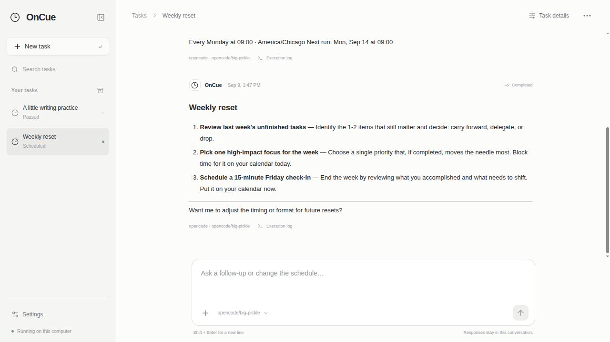
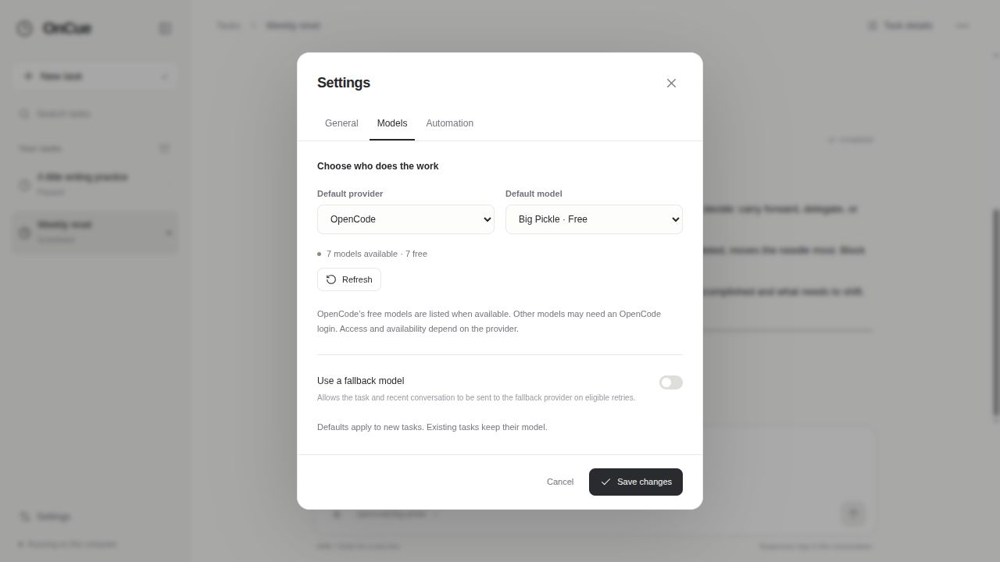

# OnCue

**Schedule AI tasks. Come back to the results.**

Tell OnCue what to do and when. It schedules the task—or asks a clarification—and
keeps every response in a conversation of its own.

- Run once, repeat on a schedule, or monitor until a condition is met.
- Use Codex with ChatGPT, or try OpenCode’s available free models without a login.
- Read earlier results, retry failures, pause tasks, and export complete history.
- Schedule from the web UI, command line, or your coding agent through MCP.



## Get started

From this checkout, with Python 3.11+:

```bash
python3 -m oncue open
```

First boot selects **OpenCode → Big Pickle**, a free model that needs no login.
Use the model picker below the message box to choose another model.
The bundled app includes both runtimes; source installs can add one from Settings.
To use Codex instead, connect your local Codex login or sign in through OnCue.
Then type something like: **“Every weekday at 9, give me a writing exercise.”**



Runs on your computer, so it needs to be awake and connected. Free-model
availability can change. Linux x86_64 bundles include Python and both AI runtimes.

[Install and configure](START.md) · [CLI and agent integration](docs/api.md) ·
[How it works](docs/architecture.md) · [Contribute](CONTRIBUTING.md)

**Alpha.** Developers and coding agents: start with [AGENTS.md](AGENTS.md).
